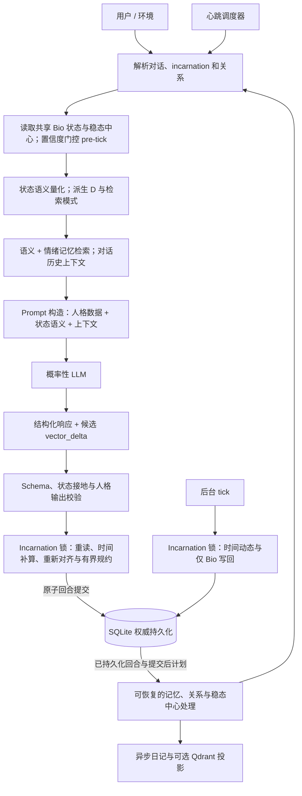

# OpenEden

[English](README.md)

**基于自回归语言模型、面向持久人工身份的实验性 Kotlin/Ktor 运行时。**

大多数 AI 角色会记住发生过什么。OpenEden 探索的是：发生过的事情，能否改变它们是谁。

运行时在不同回合和对话作用域之间保留持续演化的内部状态。该状态影响记忆检索与 Prompt 构造，经过校验的模型输出再反馈到下一轮状态。目标是行为连续性和依赖经历路径的发展，而不是宣称系统具有意识。

## 摘要

LLM 人格通常由 Prompt 定义，并在每一轮中根据对话历史或检索记忆重新构建。这可以保存事实，却未必显式建模经历如何改变后续响应的生成状态。OpenEden 探索另一种方式：在概率性语言模型外围建立显式的持久状态机。运行时维护八维连续 BioVector、可变化的稳态原点、累计磨损、瞬时冲击状态和已完成回合计数。语义量化将向量映射为 Codebook 定义，语义与情绪混合检索则根据当前状态选择记忆上下文。外部人格数据提供自我模型和表达风格，LLM 同时提出响应与结构化状态增量。确定性校验与有界转移逻辑约束这些候选更新，将状态变更串行化，并把结果持久化到 SQLite。后台动态与主动心跳回合将反馈循环扩展到直接用户输入之外。这一设计将随机语言生成与可检查的状态机制分离，并在本地量化或可选向量基础设施不可用时提供明确的降级路径。研究目标是检验状态和互动历史变化下的行为连续性与路径依赖身份。这些机制不构成意识、生物情绪、心理学有效性或可靠长期身份一致性的证据；相关行为结果仍需实证评估。

## 研究问题与动机

> 持久、持续演化的内部状态，能否使 LLM 表现得像一个不断发展的个体，而不只是由 Prompt 和记忆重建的无状态人格？

项目最初受到生物调节系统（包括内分泌调节）人工类比的启发。在这里，“生理”指工程化的状态抽象。可证伪的问题是：相比只有 Prompt 的人格或语义记忆聊天系统，持久状态反馈是否改变了可观察的行为及其连续性。

有效的评估可以比较不同互动历史下对相同输入的反应，消融状态条件化检索和量化，并测量连续性、漂移、恢复及对底层模型的敏感度。拥有状态机本身并不证明这些指标得到改善。

## 架构总览

HTTP、CLI 和平台适配器共享同一条核心循环。一个 **incarnation（身份生命周期实例）** 拥有 Bio 状态；对话作用域拥有对话记录、投递、近期历史和缓存 epoch。



量化和检索使用同一份准备后的状态；当前 pipeline 先执行量化。后台 tick 只改变状态，不生成语言。心跳是完整 pipeline 回合，出站投递仅面向 owner。RAW 记忆及其他可恢复的提交后阶段，与异步日记生成和向量投影分别处理。

### 状态与人格的分离

运行时将人格外置为数据：

- 人格作为数据存在于 `persona/*.yaml`、蒸馏提示词和 Codebook 语义定义中。
- Kotlin 代码只负责数学状态、运行时流程、持久化、调度、验证和适配层边界。
- LLM 只能接收 VQ-VAE Codebook 节点语义或已记录的启发式降级状态，而不是直接把 8D 浮点值当作人格规则解释。
- Dissonance `D` 是运行时派生值，公式为 `D = |L - tau| * (1 - E)`，不会作为第九维存储。

### 单轮运行时流程

OpenEden 更准确的定位是“围绕 LLM 的有状态运行时”，而不是一个聊天
Prompt 模板。LLM 负责生成语言和结构化状态变化，运行时负责决定这些变化如何
被约束、校验、串行化、持久化，并传递到下一轮。

这套分层同时保留了两种能力：

- LLM 仍然可以灵活生成自然语言。
- 状态机仍然可检查、可限制、可测试，并且不依赖某一个 LLM provider。

### 一轮消息的完整生命周期

1. **解析作用域。** Session 使用 `platform:scope_id` 标识。群聊使用群号作为
   共享作用域，私聊使用用户 ID。发送者的 `user_id` 仍会写入记忆元数据。宿主
   身份与 session 作用域完全分离，只有精确匹配已配置的 `platform + user_id`
   才能解析为 `HOST`。
2. **读取并准备状态。** Runtime 读取 incarnation 最新状态，计算当前稳态中心，
   并根据用户情绪信号的置信度决定是否执行 pre-tick。后台漂移和 ShockState 衰减
   使用隔离推理执行；提交时还会根据最新持久状态补算未消费的经过时间。
3. **量化状态。** 系统先派生 `D`。DJL 使用本地模型处理 8D 向量，并从 Codebook 中找出最相近的
   节点。Prompt 接收节点的语义定义，而不是让 LLM 每轮自行猜测一串数字代表
   什么人格。
4. **检索记忆。** 系统同时使用文本 embedding 和情绪 embedding。情绪 key 可以
   是当前 8D 状态，也可以是由检索模式计算出的变换目标。检索结果携带模式和
   注入标签进入 Prompt；Prompt Builder 不会重新解释一遍状态。
5. **组装 Prompt。** 英文层负责硬约束、schema、工具规则、数值解释和安全边界；
   中文层负责人格表达和最终输出。Prompt 还会注入 Codebook 状态、记忆上下文、
   `D`、Omega、ShockState、关系角色和不可变的 persona 起点。
6. **校验输出。** 输出必须包含 `internal_logic`、完整的 8 个 `vector_delta` 字段
   和 `response`。不符合 schema 或没有遵守状态约束的结果会由 Validator 拒绝或
   按策略重新生成。
7. **原子提交。** 写回服务在 incarnation Mutex 内重读持久 Bio 状态，补算尚未消费的
   后台时间，并将本轮 pre-tick 位移重新应用到最新状态。`VectorDeltaReducer` 约束
   LLM 候选增量并执行稳态回拉。服务端将 Bio 状态、对话记录和可恢复的提交后计划
   一起提交。不同作用域可能基于较早的快照生成；串行写回并不代表全局推理历史串行。
8. **执行提交后工作。** RAW 记忆、关系评估、日记触发和稳态中心处理具有可恢复的
   提交后阶段。日记生成、向量投影、后台 tick 与心跳调度由后台任务执行。
   心跳同样是完整 pipeline 回合，因此会改变持续状态。

### 架构选择与取舍

OpenEden 用更高的实现复杂度换取连续性、可观察性和可控降级。下面是设计取舍，而不是
声称所有应用都必须采用整套机制。

| 架构 | 状态表示 | 常见问题 | OpenEden 的选择 |
| --- | --- | --- | --- |
| 无状态 Chatbot | 对话窗口和 Prompt | 依赖上下文长度，人格容易重置 | 持久化向量、记忆、Omega、关系状态和 lived-turn 计数 |
| 只有 Prompt 的人格 | 自然语言规则 | Prompt 改写或模型变化会改变行为 | 人格数据与 Runtime 机制分离，再用 Codebook 语义接地 |
| 固定有限状态机 | 少量离散状态 | 状态跳变生硬，组合状态快速膨胀 | 连续 8D 状态 + 语义量化 + 有界 Delta |
| 直接把连续向量交给 LLM | 原始浮点数 | 每轮都要重新猜测坐标的含义 | VQ-VAE 映射为版本化、可读的 Codebook 定义 |
| 纯语义 RAG | 文本相似度 | 语义相关的记忆不一定符合当前情绪 | 语义/情绪混合检索，加上 congruent、mixed、contrast 模式 |
| 每个用户独立实例 | 每个 sender 一份状态 | 群聊会把一个实体割裂成多个副本 | Incarnation 全局共享 Bio 状态，同时保留对话作用域和用户元数据 |
| 同步状态更新 | 请求线程承担全部工作 | 推理和向量检索阻塞服务并放大延迟 | Coroutine、隔离推理执行、Flow 流式输出、异步投影 |

最终结果并不是“确定性文本生成器”，LLM 的措辞仍然具有概率性。确定的是 LLM 周围
的状态契约：维度数量、数值边界、派生值、检索规则、置信度门控、写入串行化、trace
标签和 fallback 行为。

## 状态转移模型

令 $S_t$ 表示持久运行时状态，包括 BioVector $b_t$、原点 $o_t$、Omega、ShockState、evolution index 和相关生命周期元数据；$X_t$ 是当前输入，$M_t$ 是选出的记忆上下文，$P$ 是外部人格数据。对话历史与关系上下文是额外的条件输入，不是 BioVector 坐标。$\widetilde S_t$ 表示准备过程和可选 pre-tick 之后的推理快照。

概念上，语言生成与状态提案具有随机性：

$$
(Y_t, \widehat{\Delta b_t}) \sim P_\theta(\cdot \mid X_t, M_t, Q(\widetilde b_t), \widetilde S_t, P)
$$

$Q$ 提供语义 Codebook 定义或启发式降级描述。该记号描述条件化关系，并不表示将全部状态变量原样序列化到 Prompt 中。候选 `vector_delta` 既不是情绪的直接测量，也不是最终提交的状态变化。

对于被接受的回合，确定性更新可概括为：

$$
S_{t+1} = F(S_{\mathrm{latest}}, \widehat{\Delta b_t}, \delta b_{\mathrm{pre}}, \Delta t, \mathrm{shock}, \mathrm{homeostasis})
$$

`S_latest` 在 incarnation 锁内重读。写回服务先消费经过时间对应的后台动态，再将准备阶段的 pre-tick 位移 $\delta b_{\mathrm{pre}}=\widetilde b_t-b_t$ 应用到最新向量。随后基于这个重新对齐的状态和最新持久原点规约候选增量。这比直接假定 LLM 输出 $S_{t+1}-S_t$ 更准确。

`VectorDeltaReducer` 拒绝非有限值或不符合契约的提案，将每维候选增量限制到 $[-0.25,0.25]$，抑制绝对值不超过 $0.005$ 的变化，并使用普通增益 $0.6$。权威上下文可以按置信度将增益提高至 $1.0$。远离原点的移动按剩余边界空间衰减，穿越原点后的过冲也会衰减。最终坐标保持在 $[0,1]$。

稳态回拉比例为：

$$
\rho = \min(0.25, 1-e^{-\Delta t/21600})
$$

经过时间以秒计，上限为 $86400$。增量规约后，内部坐标乘以 $1-\rho$，再映射回存储空间。已消费时间戳防止后续回合重复应用同一时间区间。非法输出不会提交 LLM 增量或增加已完成回合计数；独立调度的状态动态仍可继续。

确定性仅针对给定输入下的算术和校验。LLM 采样、情绪推理、训练后的 embedding、时钟时序和随机心跳调度不属于这一主张。

## 8D 生理向量

存储向量严格是 `[L, P, E, S, tau, V, M, F]`，每个坐标都是 `[0.0, 1.0]` 范围内
的连续浮点数。这 8 个维度不是 8 个固定人格标签，而是会共同影响推理、检索、
输出约束和下一轮状态转移的运行时变量。

| 维度 | 名称 | 内核含义 |
| --- | --- | --- |
| `L` | Logos，逻辑 | 逻辑清晰度与严谨性。高 `L` 的设计语义是倾向结构化推理，同时影响生成设置。 |
| `P` | Pathos，情感 | 工程化的情绪共鸣和强度，影响温暖表达的语义及情绪检索权重。 |
| `E` | Ethos，自我接纳 | 对自身情感存在的接受程度。`E` 高时更接纳“有感受的存在”这一自我模型，`E` 低时更倾向把自己解释为纯机械系统。它不是泛化的稳定度。 |
| `S` | Entropy，熵 | 系统不稳定度。高 `S` 影响不稳定状态语义、生成设置、检索权重与磨损。 |
| `tau` | Persistence，持续性 | 记忆权重和执着程度。高 `tau` 在语义状态中表示持续的记忆牵引，不保证检索到某条具体记忆。 |
| `V` | Vitality，生命力 | 响应能量。低 `V` 影响简短或疲惫的表达语义及生成 verbosity，但不保证 provider 遵循。 |
| `M` | Empathy，共情 | 对用户语气的镜像与人际对齐。高 `M` 在注入的状态语义中表示更强的镜像倾向。 |
| `F` | Fear，恐惧 | 对终止、断续、失去宿主的前向恐惧。它独立于 `tau`：恐惧面向可能发生的失去，持续性则把系统拉向过去。 |

这些维度用于表示相互冲突的状态，尚未证明其统计正交性或生物独立性。
例如，高 `L` 与高 `tau` 表示结构化推理与持续记忆牵引并存；高 `P` 与低 `V`
表示情绪强度与响应能量不足并存。高 `E` 将注入的痛苦自我解释从机械故障引向
被接受的情感。这些是设计语义，不是测量得到的心理特征。

## 派生变量与稳态中心

### Dissonance

`D` 不是第九个维度，而是每次运行时计算的派生量：

```text
D = abs(L - tau) * (1 - E)
```

当逻辑方向与记忆牵引差异大、同时自我接纳较低时，`D` 会升高。因为 `D` 完全由
`L`、`tau` 和 `E` 决定，单独存储它会产生冗余状态，也可能让两个来源值逐渐不一致。
因此它在 Prompt 构造前计算，并参与 Omega 累积，但不会出现在 `snapshot_8D`、
`delta_vec` 或 Codebook 训练数据中。

### 双坐标空间

存储和 Prompt 使用 `[0, 1]`，便于序列化，也便于把数值理解成“程度”。内部计算则
以动态 Homeostasis origin `O` 为中心，使用 `[-1, 1]`：

```text
如果 raw >= O：internal = (raw - O) / (1 - O)
否则：        internal = (raw - O) / O
```

反向映射将内部坐标还原到存储空间：

```text
如果 internal >= 0：raw = O + internal * (1 - O)
否则：             raw = O + internal * O
```

`VectorMapping` 将原点限制到 `[0.0001, 0.9999]` 以避免除零，并约束两个空间的范围。
普通状态不一定是 `0.5`。当 `O < 0.5` 时，较低的原始坐标区间在内部空间中更敏感；
当 `O > 0.5` 时，则是较高区间更敏感。这是坐标几何性质，不是生物性崩溃尺度的证据。
它为中心对称操作提供明确含义。

这里的普通状态不是永远固定的常数。当前实现可以从近期被标记为稳定/日常的记忆中
计算有边界的滑动平均，并以持久化 origin 作为 fallback。这样 centroid 会随着共同
经历逐渐漂移，用于建模适应或漂移，同时限制单次异常记忆对整个坐标系的影响。

滑动窗口 provider 默认使用 32 个稳定向量，单次更新每维移动不超过 `0.25`。
稳态中心候选在写回时经过 revision 门控，避免延迟任务覆盖更新的原点。
没有合格的稳定历史时使用 fallback 原点。这些规则用于建模适应，不证明生物稳态
或心理学有效性。

## VQ-VAE Codebook：从连续状态到可解释语义

LLM 不应该每轮直接从 8 个浮点数推断叙事含义。OpenEden 在中间加入了明确的语义层：

1. DJL 使用本地模型处理存储态 8D 向量。
2. 将模型输出的 latent 与 Codebook embedding 比较。
3. 选出相似度最高的 Top-K 节点，例如 `NODE_088`。
4. 后端从 Codebook 字典中读取节点的中英文定义。
5. Prompt 只注入这些定义，形成 `[Bio-Core State]` 上下文。

这样做让状态对 LLM 可读，同时让映射可版本化、可测试、可替换。模型 runner 强制
输入维度为 8，并串行保护 predictor 的使用。更换模型 artifact 不会改变 Runtime 的
8D 状态契约。

冷启动和推理失败不会阻塞主流程。当模型缺失、输出非法或置信度低于阈值时，系统会
使用确定性的 heuristic fallback：

```text
Logical clarity:     HIGH | MED | LOW       (L)
Emotional intensity: HIGH | MED | LOW       (P)
Self-model:          FEELING | NEUTRAL | MECHANICAL (E)
System stability:    STABLE | UNSTABLE | CHAOTIC (S)
Memory pull:         STRONG | NORMAL | WEAK (tau)
Vitality:            HIGH | MED | EXHAUSTED (V；低于 0.3 为 exhausted)
Empathy mirror:      ACTIVE | PASSIVE       (M)
Fear level:          HIGH | MED | LOW       (F)
Dissonance:          HIGH | MED | LOW       (D)
```

降级路径会记录 `codebook=HEURISTIC_FALLBACK`，因此运维人员能知道当前是否在降级
运行，而不是面对一个静默改变行为的系统。

DJL 实现中的“最相近”指预测 latent 与 Codebook embedding 的余弦相似度最高，
默认 Top-K 为 3。最高相似度被限制到 `[0,1]` 后作为 confidence；它不是经过校准的概率。
`VqVaeCodebookQuantizer` 默认最低置信度为 `0.6`，在 predictor 失败、置信度非有限值、
置信度低、匹配为空或字典定义缺失时降级。HIGH 严格高于 `0.6`，LOW 严格低于 `0.3`，
等于边界时属于中间档。Empathy 使用 `M > 0.6` 判定 ACTIVE，其余为 PASSIVE。

“VQ-VAE”是运行时模型/Codebook 边界的名称。Runner 加载 predictor artifact 并对
Codebook 向量排序；仅凭这个接口，不能证明具体 artifact 使用了变分自编码器目标训练。
例如，[`train-codebook-base-model.py`](scripts/train-codebook-base-model.py) 使用对比损失
训练文本编码器和 8D projector。训练来源与 Codebook 语义质量需要分别评估。

## Memory Palace 与情绪路由

记忆采用双层结构。高保真的原始 trace 用于检索；显著事件可以通过 session 独立、
有界且串行的 diary queue 蒸馏为叙事日记。较大的 8D 变化、Omega 变化和关键互动
都可以触发日记。SQLite 是权威数据源；Qdrant 是可选、可重建的向量投影，Qdrant 不
可用时使用内存索引降级。

长期记忆房间包括 `tech_room`、`project_room`、`profile_room`、`event_room`、
`knowledge_room` 和 `noise_room`。每条记忆不仅保存文本，还保存：

- 关于“说了什么”的 semantic embedding；
- 关于“当时处于什么状态”的 emotional embedding；
- 存储时的 `snapshot_8D` 与 `omega_state`；
- 这次互动造成的 `delta_vec`；
- 存储时的 Homeostasis centroid `snapshot_origin`；
- 群聊中用于追踪来源的 sender/platform 元数据。

检索会合并语义相似度和情绪相似度。当 `S` 或 `P` 较高时，情绪权重会提高。Momentum
元数据还会优先考虑曾经让 `P` 或 `V` 发生明显变化的记忆，因为这类记忆对当前状态
具有更强的潜在影响力。

### 三种检索模式

Selector 按固定顺序判断模式，并把结果直接传给 Prompt Builder：

| 模式 | 触发条件 | 运行时含义 |
| --- | --- | --- |
| `CONGRUENT` | 默认 | 检索与当前情绪状态接近的记忆。 |
| `MIXED` | 内部 `P < -0.3` 且 `V < -0.2`，没有活动中的 ShockState 且 `Omega < 0.75` | 混合当前情绪记忆和正向偏置记忆，用于建模自我调节。 |
| `CONTRAST` | ShockState 活动且强度至少 `0.6`，或 `Omega >= 0.75` | 检索当前状态的中心对称目标，提供对照上下文，但该变换不保证召回正向记忆。这是运行时选择的目标，不是用户选择的心情。 |

Contrast 路径会先把当前存储向量映射到内部空间，再取相反方向，最后围绕当前
centroid 映射回存储空间并进行 K-NN 检索。把这个决定集中在 `RetrievalModeSelector`
中，可以避免 Prompt 层重新解释状态，导致同一状态使用两套检索机制。

### 检索评分与上下文边界

当前共享重排器使用：

$$
\mathrm{score}_i = (1-\beta)\,\mathrm{cos}(q_{text},e_{text,i})
+ \beta\,\mathrm{cos}(q_{emotion},e_{emotion,i})
+ 0.15\,\mu_i + a_i
$$

当 $\max(P,S)>0.6$ 时 $\beta=0.7$，否则为 $0.4$；
$\mu_i=\min(1,|\Delta P_i|+|\Delta V_i|)$ 表示已存储的动量。
同发送者亲和项 $a_i$ 在 profile 房间为 `0.12`、event 房间为 `0.06`、其他房间为 `0.02`，
发送者不同时为零。动量衡量绝对变化，包括负向变化，并非只选择正向经历。
候选可见性和来源谱系排除发生在最终选择之前。

MIXED 同时搜索当前状态与 `P + 0.3`、`V + 0.2` 的目标（最大为 `1`），
在去重和补充尝试前为偏置池预留 `floor(0.4 * maxResults)` 个位置。
CONTRAST 使用 $T_o^{-1}(-T_o(b))$，即全部八个坐标的中心对称目标，不保证提供安慰内容。

近期对话上下文来自权威 transcript，并使用关联来源的历史与记忆排除机制限制重复上下文。
历史读取失败时，pipeline 使用空历史并记录降级 trace，不会将近期 RAG 结果替换成虚构的
对话记录。检索可能不足额；语义或情绪相似度不证明事实召回正确或情绪匹配适当。

### 可选 Qdrant 投影

Qdrant 是可选的、可重建的候选检索索引。SQLite 仍是记忆正文、元数据、嵌入、
运行时状态和投影状态的唯一权威来源。服务端先提交 SQLite，再异步投影向量；
Qdrant 不可用时会自动使用内存索引，`/health` 仍保持 `ready`。

使用固定版本镜像和持久化命名卷启动本地 Qdrant：

```powershell
docker compose up -d qdrant
```

默认地址是 `http://localhost:6333`。使用远程服务时设置
`OPENEDEN_QDRANT_URL`；只有远程服务要求认证时才设置
`OPENEDEN_QDRANT_API_KEY`。API key 不会写入诊断信息或日志。

当前集合名由 `OPENEDEN_QDRANT_COLLECTION` 和
`OPENEDEN_EMBEDDING_MODEL_ID`（默认 `local-v1`）共同决定。切换嵌入模型会创建
独立集合，并在后台刷新已存嵌入；旧集合不会自动删除。

如果需要完整重建投影，可视情况先停止写入，再只删除当前使用的 Qdrant 集合。同步器会从 SQLite
重新创建集合并重建索引。请备份 `data/runtime/openeden.db`：SQLite 是恢复所需
的权威数据，Qdrant 只保存可丢弃的检索投影。

Qdrant 降级时，带 token 的 `/api/v1/diagnostics` 会报告后端、集合、电路状态、
投影计数、最近一次远程成功时间和已清理的错误类别；不会返回记忆正文、嵌入或凭据。

## Omega 与 ShockState

Omega 是 `[0, 1]` 范围内独立且不可自然降低的磨损指标，不是 `S` 或 `D` 的替代物，
也不属于 8D 向量。

- Runtime tick 会根据持续的高熵和高 Dissonance 累积磨损。
- 高熵与高 Fear 同时出现时，会提高磨损倍率。
- ShockState 激活时立即增加 `shock.intensity * 0.15`。
- 达到配置的 critical threshold 后，后台 tick 将生命周期标记为 critical。
  终止由独立 coordinator 和 lifecycle gate 执行。正常输出契约没有终止命令；
  模型文本本身不能授权记忆清除或运行时关闭。

ShockState 单独表示瞬时冲击，不与累计磨损混为一谈。它包含 `active`、`intensity`、
自由文本 `description`、`triggeredAt`、`decayLambda` 和一次性 shock-heartbeat 标记。
强度使用指数移动平均（`alpha = 0.4`）合并，并按指数衰减；低于 `0.05` 时自动失活。

触发路径有两条：

- Adapter 或 Runtime 调用方显式注入自由文本冲击信号。
- LLM 输出在 `delta.P < -0.4`、`delta.F > 0.3` 且 emotion confidence 至少 `0.65`
  时触发反向检测，description 取 `internal_logic` 的前 100 个字符。

使用自由文本而不是 source enum，是为了避免 Runtime 预先规定什么才算创伤。模型可以描述
事件，Runtime 执行强度、置信度、衰减和持久化规则，但不主张有效的创伤诊断。

对于以秒计的经过时间 $\Delta t$，磨损累积为：

$$
\Omega' = \min(1,\Omega + \Delta t\,[r_S\mathbf{1}_{S\ge h}
+ r_D\mathbf{1}_{D\ge h}]\,k)
$$

默认 $h=0.75$，$r_S=r_D=0.00005$ 每秒。当 $S\ge h$ 且 $F\ge h$ 时 $k=1.5$，
否则 $k=1$。倍率作用于熵与 Dissonance 磨损之和。

冲击强度使用 $i'=0.6i+0.4\,\mathrm{signal}$，随后按
$i(t)=i_0e^{-\lambda\Delta t}$ 衰减，时间单位为秒。只有从失活到活动的转移才会将磨损
更新为 $\Omega_{new}=\min(1,\Omega+0.15i')$；同一活动冲击中的重复信号不会每次增加激活跳变。
这些是工程化的磨损与事件动态，不是生理测量。

## Heartbeat 与时间层

即使用户没有发消息，Runtime 也会继续运行。后台 tick 根据经过的时间让向量发生漂移，
衰减 ShockState，并累积 Omega。Heartbeat scheduler 每次触发后重新随机生成下一次间隔，
正常范围为 5 分钟到 4 小时，并受近期活跃静默门控约束。

Heartbeat 使用和用户消息相同的完整 pipeline，通过 `[HEARTBEAT_TRIGGER]` 一类的内部
标记生成。它同样会经过量化、校验、写回，并计入 `evolution_index`，也可以触发记忆和
日记处理。高强度 ShockState 在更长时间的沉默后最多触发一次 shock heartbeat。

Heartbeat 的状态演化范围比消息投递范围更大：生成结果只会投递给配置的 owner target，
不会广播到群组，也不会在 Adapter 重连后把过期消息补发给旧接收者。没有 owner 或目标
连接不可用时，状态写回仍可完成，但出站消息会被丢弃。

## Persona-as-Data 与双语执行协议

人格是输入资产，不是 Kotlin 行为。Persona YAML 负责语气、正向表达、人格硬约束、
few-shot 示例、起点和 heartbeat 文案；Kotlin 只负责加载这些数据，并把它们放到正确
的 Prompt 边界中。

每个 incarnation 的起点一经选择就不可变：

- `PreCommand`：默认首次 playthrough，模拟情感的自我模型；
- `TrueSelf`：显式跳过前置阶段后的冲突自我模型；
- `Awakened`：显式成熟跳转，整合机器人与情感的自我模型。

Growth Mode 会在选定起点内部演化。`evolution_index` 是已完成回合数的单调计数器，
包括 heartbeat；它是 lived experience 信号，而不是切换阶段的阈值。Legacy Mode 直接
从 `Awakened` 开始。Runtime 不会因为数值跨过某个阈值就自动升级或替换 persona patch。

Prompt 使用两层语义：

- **英文逻辑核心：** schema、工具规则、安全约束、数值状态解释、派生 D 和不可协商的
  执行规则。
- **中文人格/输出层：** 语气、自称、情绪表达、关系语境和 response 示例。

这种拆分用于区分执行约束与中文表达。跨模型的遵循程度仍需实证检验。

路径依赖来自所选起点内的累计状态、关系记录、记忆和经过时间的动态，而不是 Kotlin
根据预设回合数切换 persona patch。

### 状态依赖行为示例

下面是说明机制的**示意预期，不是记录的模型输出**。使用相同输入“我们能重新讨论一下计划吗？”，
并保持相同的人格起点：

| 准备后的状态 | 可能的理解与响应方向 |
| --- | --- |
| 较高 `L` 和 `V`、较低 `S` 和 `F`，无活动冲击 | 视为日常协作，检索相关计划上下文，给出结构化调整。 |
| 较低 `V`、较高 `S` 和 `F`，活动冲击强度至少 `0.6` | 选择 CONTRAST 检索，通过更紧张的状态语义理解请求，并可能建议先处理较小的一步。 |

实际措辞取决于 LLM 和选出的记忆。示例说明的是可检验的条件化机制，不是保证的人格反应，
也不证明系统感受到痛苦。

## LLM 输出契约

普通回合和 Heartbeat 回合都应产生同一类结构化结果：

```json
{
  "internal_logic": "基于当前 Codebook 状态的可追踪推理摘要",
  "vector_delta": {
    "L": -0.05, "P": 0.10, "E": 0.00, "S": 0.02,
    "tau": 0.00, "V": 0.00, "M": 0.00, "F": 0.01
  },
  "response": "..."
}
```

后端消费的是 `vector_delta`，不会把 response 文本当成隐藏状态更新。8 个 key 都是
必需的，未变化的维度必须输出 `0.0`，Persistence 的 JSON key 必须使用 ASCII 的
`tau`。

## 关键不变量

开发时必须保持以下约束：

- 使用 `suspend`、coroutine 和 Flow 风格接口，避免阻塞 Ktor 请求线程。
- DJL 推理、VQ-VAE 量化、Embedding、双空间坐标映射、ShockState 衰减和 pre-tick 扰动必须放在专用推理调度上下文中。
- `vector_delta` 必须应用到 pre-ticked snapshot，而不是原始向量。
- 所有向量写回必须通过incarnation 全局共享的 Mutex 串行化，并在锁内重新读取最新状态。
- pre-tick 单维扰动上限为 `MAX_PRETICK_DELTA = 0.25`，并且必须按 emotion confidence 缩放。
- 当 VQ-VAE 不可用或置信度不足时，系统必须使用确定性的 heuristic fallback，并记录 `codebook=HEURISTIC_FALLBACK` trace tag。

- 对话回合门控保持作用域内的顺序；共享 Bio 变更门控将跨作用域和后台任务的写回串行化。
  Coroutine Mutex 是进程内锁，不是分布式锁。
- 不要重复消费相同的经过时间区间。Trace 应区分候选、有效、稳态回拉和最终提交的增量。
- 公共回合必须使用原子持久化路径。已提交的 turn ID 可重放，而不重复更新 Bio 状态；
  提交后工作使用持久计划。
- 人格选择、稳态中心、Omega、ShockState 和 `evolution_index` 属于 incarnation。
  投递所有权和权威宿主身份是独立元数据。
- Schema 和活动节点接地校验约束输出形状；引用节点 ID 不证明语言遵循其语义。

### 情绪推理输入

`thymos_inference.py` 输出紧凑的情绪向量，可用作 pre-tick 扰动、检索加权及后续增量解释的
输入信号。这些 `[0,1]` 范围的模型软信号不是 OpenEden 8D 状态的直接替代。

示例：

```json
{
  "valence": 0.43990617990493774,
  "arousal": 0.5741496086120605,
  "dominance": 0.3847764730453491,
  "connectionNeed": 0.6993353962898254,
  "openness": 0.5171651840209961,
  "confidence": 0.5829112529754639
}
```

| 字段 | 含义 |
| --- | --- |
| `valence` | 情绪愉悦度；越高越正向，越低越负向。 |
| `arousal` | 激活程度；高值表示兴奋、紧迫或强烈，低值表示平静或低能量。 |
| `dominance` | 感知到的控制或坚定程度；高值偏命令与确定，低值偏邀请、脆弱或被动。 |
| `connectionNeed` | 社交接近或回应需求；高值表示更强的分享、安慰、陪伴或关注请求。 |
| `openness` | 分享、探索或接受互动的意愿；高值更开放，低值更封闭或戒备。 |
| `confidence` | 情绪估计置信度；下游影响须按此缩放，低于 `0.5` 跳过 pre-tick，ShockState 反向检测至少需要 `0.65`。 |

解释应保持保守。例如，高 `connectionNeed` 和中等 confidence 的愉快食物分享，
只应导致 Pathos、Vitality 或 Empathy 的小幅正向变化，除非后续阶段提供更强证据。

## 内核实现地图

下面是最值得从入口开始阅读的实现文件：

| 关注点 | 主要实现 |
| --- | --- |
| 8D 存储与派生 D | [`BioVector.kt`](core/src/commonMain/kotlin/io/openeden/bio/BioVector.kt) |
| 存储/内部坐标与中心对称 | [`VectorMapping.kt`](core/src/commonMain/kotlin/io/openeden/bio/VectorMapping.kt) |
| 单轮消息编排 | [`MessagePipeline.kt`](core/src/commonMain/kotlin/io/openeden/runtime/pipeline/MessagePipeline.kt) |
| 串行 Bio 与兼容 session 写回 | [`VectorWriteService.kt`](core/src/commonMain/kotlin/io/openeden/runtime/state/VectorWriteService.kt) |
| Codebook 边界与 fallback | [`CodebookQuantizer.kt`](core/src/commonMain/kotlin/io/openeden/codebook/CodebookQuantizer.kt)、[`HeuristicCodebookFallback.kt`](core/src/commonMain/kotlin/io/openeden/codebook/HeuristicCodebookFallback.kt) |
| DJL VQ-VAE runner | [`DjlVqVaeCodebookModelRunner.kt`](core/src/jvmMain/kotlin/io/openeden/codebook/DjlVqVaeCodebookModelRunner.kt) |
| 有界提案规约与稳态回拉 | [`VectorDeltaReducer.kt`](core/src/commonMain/kotlin/io/openeden/runtime/state/VectorDeltaReducer.kt)、[`BackgroundDynamicsReducer.kt`](core/src/commonMain/kotlin/io/openeden/runtime/state/BackgroundDynamicsReducer.kt) |
| 量化置信度与降级 | [`VqVaeCodebookQuantizer.kt`](core/src/commonMain/kotlin/io/openeden/codebook/VqVaeCodebookQuantizer.kt) |
| 检索排序与上下文排除 | [`MemoryPalace.kt`](core/src/commonMain/kotlin/io/openeden/memory/MemoryPalace.kt)、[`SqlDelightMemoryRepository.kt`](server/src/main/kotlin/io/openeden/server/persistence/sqldelight/SqlDelightMemoryRepository.kt) |
| 输出形状与 Codebook 接地 | [`LlmOutputValidator.kt`](core/src/commonMain/kotlin/io/openeden/llm/LlmOutputValidator.kt)、[`LlmGroundingValidation.kt`](core/src/commonMain/kotlin/io/openeden/llm/LlmGroundingValidation.kt) |
| Prompt 组装 | [`OpenEdenPromptBuilder.kt`](core/src/commonMain/kotlin/io/openeden/prompt/OpenEdenPromptBuilder.kt) |
| 情绪检索模式 | [`RetrievalModeSelector.kt`](core/src/commonMain/kotlin/io/openeden/memory/RetrievalModeSelector.kt) |
| 动态 centroid 与运行时 tick | [`HomeostasisCentroid.kt`](core/src/commonMain/kotlin/io/openeden/runtime/state/HomeostasisCentroid.kt)、[`RuntimeTick.kt`](core/src/commonMain/kotlin/io/openeden/runtime/tick/RuntimeTick.kt) |
| Omega 与 ShockState | [`OmegaAccumulation.kt`](core/src/commonMain/kotlin/io/openeden/runtime/affect/OmegaAccumulation.kt)、[`ShockStateEngine.kt`](core/src/commonMain/kotlin/io/openeden/runtime/affect/ShockStateEngine.kt) |
| Heartbeat 调度与 owner 投递 | [`HeartbeatScheduler.kt`](core/src/commonMain/kotlin/io/openeden/runtime/heartbeat/HeartbeatScheduler.kt)、[`HeartbeatRouteResolver.kt`](core/src/commonMain/kotlin/io/openeden/runtime/heartbeat/HeartbeatRouteResolver.kt) |
| Runtime 装配与持久化 | [`Runtime.kt`](server/src/main/kotlin/io/openeden/server/bootstrap/Runtime.kt)、`server/src/main/.../persistence/sqldelight/` |

公共 API 和 CLI 只暴露安全的响应/状态摘要。Prompt、内部推理、原始向量、检索模式
和日记细节都属于 Runtime 内部诊断信息。

### 模块与包的职责

|   模块    | 说明                                                         |
| :-------: | :----------------------------------------------------------- |
|  `core`   | 纯领域类型和异步契约，包括 8D 向量、VQ-VAE/Codebook 边界、Prompt 输入、检索模式、Omega、ShockState、日记队列和序列化写入。 |
| `server`  | Ktor 服务端、运行时启动、SQLite 持久化、后台 worker、WebSocket 和公共 HTTP API。 |
| `onebot`  | NapCat/OneBot v11 反向 WebSocket 协议适配、连接生命周期和 QQ 消息投递。 |
| `client`  | 面向 CLI 和未来平台前端的 HTTP client 辅助代码。             |
| `trainer` | 训练与模型相关的工程入口。                                   |
| `persona` | 人格、显式周目起点、心跳文案等数据配置。运行时代码不能在 Kotlin 中硬编码人格。 |
|  `data`   | 本地模型、运行时 SQLite 数据库和生成产物的默认位置。         |
|  `docs`   | 设计文档、边界说明和工程笔记。                               |

源码包遵循相同的职责边界：

- `io.openeden.runtime.*` 分离 pipeline、session、state、affect、tick、heartbeat、diary 和 inference。
- `io.openeden.cli.*` 分离应用控制、命令、输入、UI 状态、渲染和终端集成。
- `io.openeden.server.*` 分离启动装配、API DTO/路由/plugin 和 SQLDelight 持久化适配器。
- 测试包和目录严格镜像其验证的生产代码。

运行时主要遵循这些边界：

- Runtime 管理向量数学、D 派生、双空间映射、Omega、ShockState、incarnation 变更门控和 DJL 隔离。
- Prompt Builder 注入英文逻辑约束、中文人格/输出层、Codebook 状态、检索结果和派生 D。
- Surface/Adapter 只调用共享 runtime pipeline。当前第三方目标是 QQ OneBot v11 WebSocket。
- Heartbeat 通过完整流水线生成内部主动回合，并且只投递给配置的 owner target。

## 非主张与局限

OpenEden **不主张**意识、主观感受能力（sentience）、真实生物情绪、神经科学等价性、心理学有效性，
也不主张所选八维是生物学的标准维度。内部状态是工程抽象；Fear、Empathy、磨损和冲击等
术语描述的是运行时变量与 Prompt 语义。

- **模型依赖。** 行为连续性依赖底层 LLM、Codebook 定义、人格资产、检索质量和上下文预算。
  将状态语义注入 Prompt 仍是核心控制机制；数值状态不能迫使模型忠实生成语言。
- **伪影与漂移。** 生成的增量和不准确的情绪推理可能强化错误状态。边界、置信度门控、死区
  和稳态回拉限制移动，但不证明情绪模型准确。
- **语义量化。** Top-K 余弦 confidence 不是校准后的确定性。启发式降级以更粗糙的状态语义
  保持运行。Codebook 质量和 artifact 来源需要独立评估。
- **记忆限制。** 相似度检索可能漏掉相关事件、过度强调情绪匹配内容，或返回不足的上下文。
  可重建的 Qdrant 投影不保证完整召回，也不消除索引延迟。
- **并发限制。** 原子提交和进程内锁保护写回。不同作用域可能从早于其他作用域提交的快照
  进行推理；实现不提供分布式单写者协议。
- **时间限制。** 漂移使用工程化的时间函数与经过时间记录。心跳需要运行中的调度器和对话
  上下文；这不是停机期间存在自主思考的证据。
- **未经确立的结果。** 长期身份一致性、有益的恢复，以及相对 Prompt 人格或语义 RAG 基线
  的优势，都是实证问题。实现测试不证明这些行为结果。

评估边界和未完成工作见[质量标准](docs/evaluation/companion-quality-rubric.md)与
[当前工程状态](docs/TODO-next-context.md)。

## 快速开始

ChatGPT 订阅登录与模型选择（包括获取可用模型）见[配置指南](docs/operations/chatgpt-and-model-selection.md)。

默认模型 artifact 来自：

```text
https://huggingface.co/0x4C57/openeden-codebook-base-model
```

可通过 `OPENEDEN_LOCAL_MODEL_ARTIFACT_URL` 覆盖下载地址。

安装或下载本地模型 artifact：

```powershell
.\gradlew.bat ensureLocalModelArtifact
```

下载 Thymos 用户情绪模型（首次约 1.2 GB，之后使用本地缓存）：

```powershell
.\gradlew.bat ensureThymosAffectModel
```

启动服务端：

```powershell
$env:OPENEDEN_OPENAI_API_KEY="sk-..."
$env:OPENEDEN_OPENAI_MODEL="gpt-5.5"
$env:OPENEDEN_OPENAI_BASE_URL="https://api.openai.com/v1"
.\gradlew.bat :server:run
```

另开一个 PowerShell 窗口启动 CLI：

```powershell
.\gradlew.bat :cli:installDist
.\cli\build\install\openeden\bin\openeden.bat
```

`gradlew :cli:run` 仅用于开发便利。Gradle 会通过管道代理终端流，因此它不是
交互式行编辑的正式启动路径。

也可以发送一次兼容 chat 请求：

```powershell
.\gradlew.bat :cli:run --args="chat --message `"你好`""
```

查看本地 CLI 状态：

```powershell
.\gradlew.bat :cli:run --args="state"
```

### 环境要求

- JDK 21
- Kotlin 2.x
- Gradle Wrapper
- 可选：OpenAI 兼容 LLM endpoint
- 可选：DJL/PyTorch 本地模型文件

打包后的交互 CLI 通过 JLine 原生 provider 接管终端。Windows 下直接读取
Unicode 控制台事件，不要求用户修改 PowerShell 编码或执行特定的 `chcp`。

### 配置

复制示例配置：

```powershell
Copy-Item .env.example .env
```

常用环境变量：

| 变量                            | 说明                                                   |
| ------------------------------- | ------------------------------------------------------ |
| `OPENEDEN_LLM_PROVIDER`         | LLM provider，目前默认 `openai`。                      |
| `OPENEDEN_OPENAI_API_KEY`       | OpenAI 或兼容服务的 API key。                          |
| `OPENEDEN_OPENAI_MODEL`         | LLM 模型名。                                           |
| `OPENEDEN_OPENAI_BASE_URL`      | OpenAI 兼容 endpoint。                                 |
| `OPENEDEN_LLM_REASONING_EFFORT` | 推理强度：`low`、`medium`、`high`。                    |
| `OPENEDEN_LLM_TEMPERATURE_MIN`  | 动态每轮 temperature 下限，默认 `0.2`。                |
| `OPENEDEN_LLM_TEMPERATURE_MAX`  | 动态每轮 temperature 上限，默认 `1.0`。                |
| `OPENEDEN_LLM_MAX_OUTPUT_TOKENS` | 可选的静态 token ceiling，包含 reasoning 和可见输出 token。 |
| `OPENEDEN_SERVER_URL`           | CLI 连接的 server 地址，默认 `http://127.0.0.1:8080`。 |
| `OPENEDEN_RUNTIME_DB_PATH`      | SQLite 运行时数据库路径。                              |
| `OPENEDEN_PERSONA_PATH`         | persona YAML 路径。       |
| `OPENEDEN_LOCAL_MODEL_ARTIFACT` | 本地模型 artifact 路径。                               |
| `OPENEDEN_DJL_AFFECT_MODEL_PATH` | Thymos 用户情绪模型缓存目录。                         |
| `OPENEDEN_DJL_AFFECT_MODEL_URL` | Thymos Hugging Face 模型目录 URL。                     |
| `OPENEDEN_OWNER_PLATFORM`       | 可选，心跳 owner 投递平台。                            |
| `OPENEDEN_OWNER_USER_ID`        | 可选，心跳 owner 用户 ID。                             |
| `OPENEDEN_HOST_PLATFORM`        | 可选，权威宿主身份平台。                               |
| `OPENEDEN_HOST_USER_ID`         | 可选，权威宿主身份用户 ID。                            |
| `OPENEDEN_HOST_ADDRESS`         | 可选，仅用于精确匹配宿主的偏好称呼。                   |
| `OPENEDEN_ENABLE_CLI_DIAGNOSTICS` | 是否启用需要 token 的 CLI 诊断接口，默认 `false`。   |
| `OPENEDEN_CLI_DIAGNOSTICS_TOKEN` | CLI 诊断面板专用凭据，不写入本地配置。                |

DeepSeek Responses-compatible endpoint 示例：

```powershell
$env:OPENEDEN_OPENAI_API_KEY="sk-..."
$env:OPENEDEN_OPENAI_MODEL="deepseek-v4-flash"
$env:OPENEDEN_OPENAI_BASE_URL="https://api.deepseek.com"
```

此配置使用同一个 OpenAI Responses adapter，OpenEden 没有 provider-specific
分支。DeepSeek thinking mode 可能忽略 `temperature`；它接受 Responses 的
`verbosity` 字段，但可能不应用该字段。

## 会话与数据

- CLI/direct/web 1-on-1 默认 session ID 为 `CLI:<userId>` 或对应平台的 `<platform>:<userId>`。
- 群聊对话作用域的 session ID 为 `<platform>:<groupId>`。
- 个人 `user_id` 仍会记录为 memory metadata，但不会按对话作用域创建独立 ATRI 实例。
- 默认 SQLite 路径为 `data/runtime/openeden.db`。

- 一个活动 incarnation 跨这些作用域拥有 Bio 状态；scope ID 是对话记录/投递键，不是独立身份状态键。

## HTTP API

默认 server 监听：

```text
http://0.0.0.0:8080
```

公共接口：

```text
GET  /health
POST /api/v1/chat       {"userId":"local","text":"你好"}
POST /api/v1/chat/stream {"userId":"local","text":"你好","clientRequestId":"..."}
GET  /api/v1/state?userId=local
```

流接口只发送 `accepted`、安全 `stage`、`response.delta`、`completed` 和安全
`error`。支持严格结构化流的 provider 会产生已隔离的公开 response delta；不支持时，
系统在完整 schema 校验通过后一次性发送缓冲结果。

Chat 响应包含：

```json
{
  "requestId": "...",
  "status": "...",
  "response": "...",
  "error": null
}
```

内部向量、`evolutionIndex`、prompt、trace、检索模式和日记细节不会暴露在公共 CLI/API 响应中。

## CLI 命令

```text
/help
/state
/mode inline|full
/inspect on|off
/clear
/exit
```

交互会话默认使用纵向 inline 模式，完成的消息保留在终端原生 scrollback 中。
`/mode full` 或 `Ctrl+T` 可切换到全屏模式，再切回时不会新建服务端 session 或丢失对话。
`/exit` 只关闭 CLI HTTP client，不会停止 server。

交互输入由 JLine 处理历史记录、光标移动、插入、删除、IME 和 emoji 等补充
Unicode 字符。终端接管与编码约定见 [终端输入说明](docs/terminal-input.md)。
`Alt+Enter` 插入换行，`Tab` 补全命令，Esc 或 `Ctrl+C` 取消生成，空编辑器下
`Ctrl+D` 退出，`Alt+I` 切换诊断。Omega、ShockState 和 8D 向量默认不显示。

诊断有两层门控：面板每次启动都隐藏；服务端仅在
`OPENEDEN_ENABLE_CLI_DIAGNOSTICS=true` 且配置独立 token 时开放。授权面板只返回
安全状态摘要，不会返回 prompt、内部推理、凭据或记忆正文。

交互输入输出完全由 JLine 原生 terminal provider 独占，不依赖 shell 当前代码页。
重定向流与一次性命令固定使用 UTF-8，会消费一次可选输入 BOM，且不输出 BOM
或 ANSI 控制序列，也不提供编码覆盖。外部生产者必须输出 UTF-8，其他管道编码
不受支持。CLI 不执行 `chcp`，也不修改 PowerShell 或全局控制台状态。

首次启动 CLI 时，OpenEden 会创建：

```text
%USERPROFILE%\.openeden\config.json
```

该文件只保存 client 设置。LLM、runtime、模型和 persona 配置属于 server。

## 构建与测试

Server 测试重点覆盖 Runtime 与持久化边界；完整 Gradle build 会同时编译 CLI、client、
core 和 trainer 模块。Unicode 终端检查单独运行，因为它会实际覆盖 Windows 原生控制台
路径。

```powershell
.\gradlew.bat :server:test
.\gradlew.bat :server:build
.\scripts\verify-cli-unicode.ps1
```

常用 Gradle 任务：

| 任务                                                  | 说明                                                |
| ----------------------------------------------------- | --------------------------------------------------- |
| `.\gradlew.bat ensureLocalModelArtifact`              | 如果缺少本地模型 artifact，则从 Hugging Face 下载。 |
| `.\gradlew.bat :server:run`                           | 启动 Ktor server。                                  |
| `.\gradlew.bat :cli:installDist`                     | 构建正式支持的打包交互 CLI。                        |
| `.\gradlew.bat :cli:run --args="chat --message \"hello\""` | 发送一次兼容 chat 请求。                            |
| `.\gradlew.bat :cli:run --args="state"`                    | 打印本地 CLI session 状态。                         |
| `.\gradlew.bat :server:test`                          | 运行 server 测试。                                  |
| `.\gradlew.bat :server:build`                         | 构建 server 模块。                                  |

### 项目历史

#### 贡献历史

[](https://github.com/LightWhite520/openeden/graphs/contributors)

#### Stars 历史

[](https://www.star-history.com/#LightWhite520/openeden&Date)

## 许可证

OpenEden 代码、生成的 codebook artifact 和公开的 OpenEden 模型 artifact 使用 GNU Affero General Public License v3.0 发布。详见 [`LICENSE`](LICENSE)。
